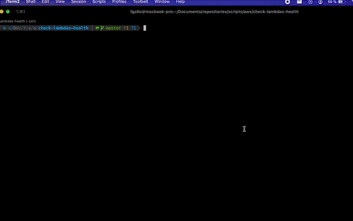

# rooster-cloud-lambda-util
This  script suite help us to analyze and observe (in the most easy way possible) the state of our lambdas. With this script you can check how many lambdas are up, if they are with code or not, which response you receive if it is invoke and also you can watch the last CloudWatch log.

## Requirements

- Linux or Unix environment. This script was testing in Ubuntu 20.04 and macOS Monterey 12.1
- `aws-cli` installed and configured (aws profile with `aws_access_key_id` and `aws_secret_access_key`). We need to have this installed because is with this tool that the script collect all the data about our lambdas.
- `jq` . If the script detects this dependency is not installed it will perform the installation so, not worry. This dependency is used to make some actions on JSON documents.

## ¿How to use it?

`bash check-lambdas-health.sh [-p <aws_profile_name>] [-f <filter>] [-h]`

- `-p`(profile): This flag is used to determine with which aws profile we are going to execute our scripts
- `-f`(filter): This flag is used to filter certain lambdas by name. Inside it is a grep, therefore we can obtain 1 or several lambdas according to the filter. If this flag is not used, all the lambdas that we can see with our profile will be brought
- `-h`(help): This flag will show us help information to use the script.

> As you can see, you can simply execute the script without any flag. This take “default” like profile name of aws configuration and no filter of searching.
>

Some examples to understand better:

- `bash check-lambdas-health.sh` → This execute the scripts with default values and no filter
- `bash check-lambdas-health.sh -p staging` → This execute the scripts with “staging” profile
- `bash check-lambdas-health.sh -p staging -f test` → This execute the scripts with “staging” profile and filter the lambdas that name contains “test”.

## ¿What can i perform?

- CloudWatch last log for lambdas.
- Invoke to each of it to see StatusCode and FunctionError.
- CodeSize (configurable) to know if the lambda have or not code deployed.
- Lambdas counter

Demo:

